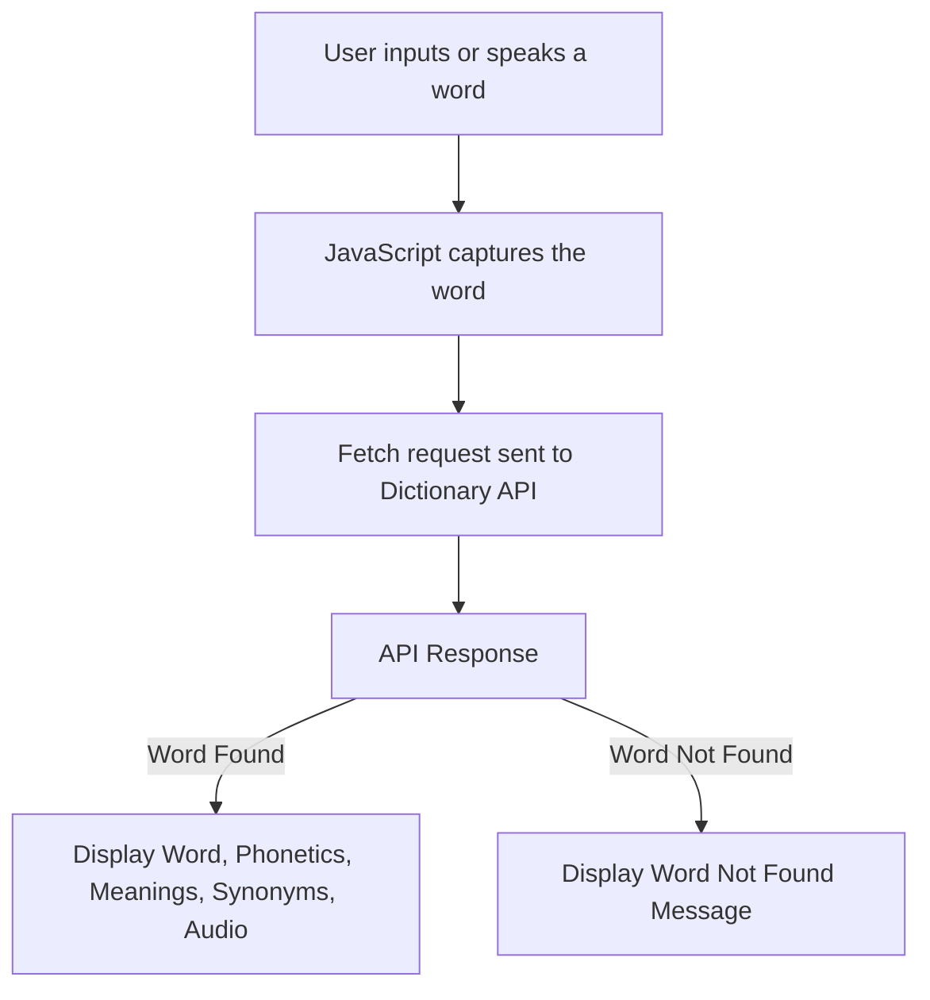

# 🌟 WordWave – Modern Dictionary Application

## **📘 Overview**

**WordWave** is a modern Dictionary Web Application that allows users to look up word definitions, phonetics, synonyms, and usage examples in real-time. It utilizes the Free Dictionary API to deliver accurate and up-to-date word data. Built with HTML, CSS, and JavaScript, the application features voice search, search history, and responsive design for a smooth and interactive experience across devices.

## **✨ Key Features**

- **Word Search:** Instantly search for word meanings, phonetic transcription, and usage examples.
- **Voice Search:** Use your microphone to speak and search for words hands-free.
- **Phonetics Audio:** Listen to correct word pronunciation when phonetic audio is available.
- **Recent History:** View and revisit your recent word searches with a dropdown.
- **Responsive Design:** Fully optimized for desktop, tablet, and mobile devices.
- **Error Handling:** Displays a friendly message when the searched word is not found.
---

### 🎨 *User Interface*

- *Header:*  
  Displays the application title *"WordWave"* along with a short tagline "Explore words with style and sound" to introduce the purpose of the app.

- *Search Box:*  
  A prominently centered input field where users can *type a word* they want to look up.

- *Search Actions:*  
  - 🔍 *Search Button* to fetch word details  
  - 🎤 *Microphone Button* to perform *voice-based search*  
  - 🔁 *History Button* to access recently searched words

- *Result Area:*  
  Initially hidden, this section becomes visible after a word is searched. It displays:
  - The *word title*
  - *Phonetic transcription*
  - *Audio button* to hear pronunciation
  - *Definitions, **examples, and **synonyms*
  - A user-friendly *"Word not found"* message if the lookup fails

  ---
  ### 📂 *Project Files*

- *index.html*  
  Contains the complete *HTML structure* of the application, including the header, search input, buttons, and result display layout.

- *style.css*  
  Provides the *styling* for the application, including layout, colors, animations, responsive design, and component appearance.

- *script.js*  
  Handles all the *functionality* of the app, such as:
  - Fetching word data from the Dictionary API
  - Managing voice search with Speech Recognition
  - Updating the UI dynamically based on user interactions
  - Managing search history and playback of word pronunciation
    
## 🛠 Tech Stack

- *HTML* – Structure of the app  
- *CSS* – Styling and layout  
- *JavaScript* – Logic and interactivity  
- - *Free Dictionary API* – For fetching word data

### 📦 **Dependencies**

- **HTML**  
  Structure of the WordWave application, organizing the header, search section, and result display areas.

- **CSS**  
  Styling for layout, colors, animations, responsiveness, and overall visual polish.

- **JavaScript**  
  Handles the search functionality, API integration, audio playback, voice input, and dynamic DOM updates.

- **Dictionary API**  
  [DictionaryAPI.dev](https://dictionaryapi.dev/)  
  - Used to fetch word definitions, phonetics, examples, and synonyms.

- **Font Awesome**  
  [CDN Link](https://cdnjs.cloudflare.com/ajax/libs/font-awesome/5.15.4/css/all.min.css)  
  - Provides the icons like the **volume (audio)** icon for pronunciation.

- **Google Fonts - Poppins**  
  [CDN Link](https://fonts.googleapis.com/css2?family=Poppins&display=swap)  
  - Used for clean and modern typography throughout the app.
 
    
  ### 🛠️ **Technical Implementation**

- The application uses the **[Dictionary API](https://dictionaryapi.dev/)** to **fetch word data** such as meanings, phonetic transcriptions, examples, and synonyms.

- **JavaScript** is used to:
  - Make API requests and handle asynchronous data fetching.
  - Dynamically update the HTML elements based on the search results.
  - Manage additional functionalities like voice input (Speech Recognition) and search history.

- **CSS** is applied to:
  - Style the layout, create a clean dark theme, and add visual effects.
  - Ensure the app is **responsive** and **user-friendly** across desktop and mobile devices.
---
### 🔄 **API Integration Workflow**


---
### ⚠️ *Error Handling*

- If the API cannot find a word, a *"Word Not Found"* message is shown.
- If there’s a network issue, an alert informs the user.
- If speech recognition fails, an error alert is displayed.
  The app ensures that users are always notified clearly in case of any issue.
  
---
### 🔊 *Audio Pronunciation*

- Plays the correct pronunciation of the searched word using the phonetic audio provided by the API.
- The audio button appears only if a pronunciation is available.
---
   
## 👥 *Team Member Roles*

| Team Member           | Role and Contributions |
|:----------------------|:------------------------|
| *Saihajpreet Kaur*   | Coordinated overall project structure and contributed to the HTML structure, worked on CSS design, implemented parts of the JavaScript functionality, and actively resolved UI and logic-related issues. |
| *Ranjot Kaur*        | Assisted in building HTML sections, styled components using CSS, added JavaScript functionalities, and helped in debugging and fixing design alignment problems. |
| *Ronit Khanna*       | Worked on implementing search functionality and integrated parts of the Dictionary API responses in JavaScript, and participated in solving code-related issues. |
| *Om Aggarwal*        | Helped in creating dynamic HTML sections, worked on CSS improvements, contributed to JavaScript code for interactivity, and supported in identifying and fixing technical bugs. |

##👥 *Team Collaboration Summary*
All team members actively contributed across UI design, functionality development, and issue resolution, ensuring a smooth and collaborative project execution.

##💡 *Future Improvements*

- Add Dark Mode and Light Mode toggle
- Add auto-suggestions while typing words
- Add bookmarking feature to save favorite words
- Include offline word lookup support

## 🚀 How to Run

```bash
# Clone the repository
git clone https://github.com/Saihajpreet-Kaur/Project_Dictionary.git

# Open the folder and open the index.html file in any web browser
